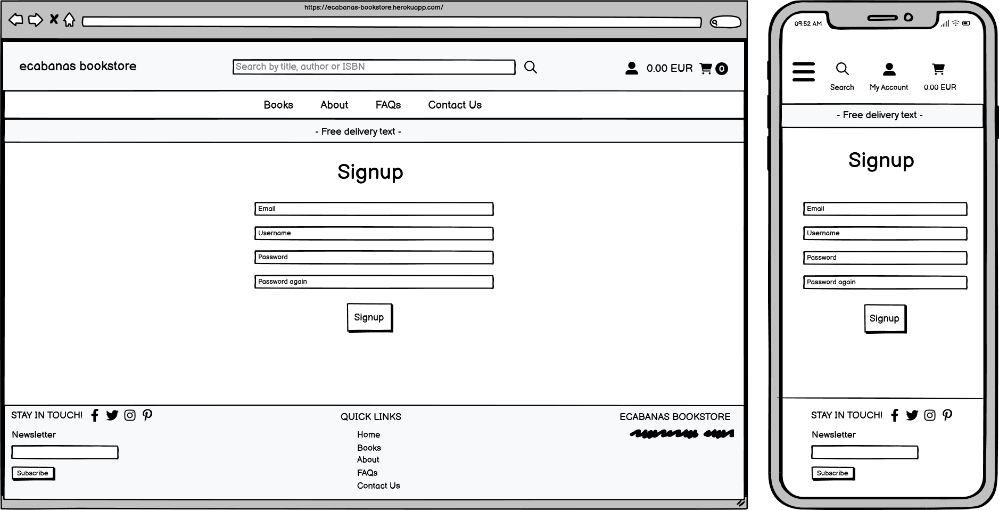

# ecabanas bookstore

Welcome to my ecommerce bookstore, Ecabanas! As part of my final project for this course, I have created an online bookstore that offers a wide selection of books in various categories, including fiction and non-fiction.

My aim with this project was to create an intuitive and user-friendly platform that allows visitors to easily find and purchase their favorite books. In addition to browsing books by category, users can also search for specific titles or authors using the search bar.

To ensure the security of users' personal information, I have implemented security measures, including user authentication and form validation. All transactions are processed securely through the Stripe payment system.

Please note that this website is for educational purposes only, and should not be used to enter any personal credit/debit card details. To test the system, you can use the test card details provided in Stripe's documentation [here](https://stripe.com/docs/testing#cards).

The live link can be found here - [ecabanas bookstore](https://ecabanas-bookstore.herokuapp.com/)


## Table of Contents

# Table of Contents

- [UX Design](#ux)

  - [User Stories](#user-stories)
  - [Design](#design)
    - [Colour Scheme](#colour-scheme)
    - [Images](#images)
    - [Fonts](#fonts)
    - [Wireframes](#wireframes)

- [Agile Methodology](#agile-methodology)
- [Database Schema](#database-schema)
- [Security](#security)
  - [User Authentication](#user-authentication)
  - [Form Validation](#form-validation)
  - [Database Security](#database-security)
  - [Custom error pages:](#custom-error-pages-)
- [Features](#features)
  - [Header](#header)
  - [Footer](#footer)
  - [Home Page](#home-page)
  - [User Account Pages](#user-account-pages)
  - [Profile](#profile)
  - [Books list](#book-list)
  - [Book detail](#book-detail)
  - [Favourites](#book-favourites)
  - [Cart](#cart)
  - [Checkout](#checkout)
  - [Contact Form](#contact-form)
  - [Error Pages](#error-pages)
- [Business Model](#business-model)
- [Marketing Strategy](#marketing-strategy)
  - [SEO](#seo)
  - [Content marketing](#content-marketing)
  - [Social Media Marketing](#social-media-marketing)
  - [Email Marketing](#email-marketing)
- [Testing](#testing)
- [Deployment](#deployment)
- [AWS Set Up](#aws-set-up)
- [Forking this repository](#forking-this-repository)
- [Cloning this repository](#cloning-this-repository)
- [Languages](#languages)
- [Libraries](#libraries)
- [Credits](#credits)
- [Acknowledgments](#acknowledgments)

# UX Design

The type of user that I have in mind for this website is a book lover who enjoys reading a wide variety of books. The user is likely to be a student or a professional who is looking for a convenient way to purchase books online. The user is likely to be familiar with online shopping and will be comfortable with the process of creating an account and making a purchase.

## User Stories

EPIC: User Navigation   

- As a user of the online bookstore website, I want to be able to easily navigate to different sections of the website, so that I can find what I am looking for quickly and efficiently.

- As a user, I want to browse through the list of books available on the website to find books that interest me.
- As a user, I want to be able to sort books based on different criteria, such as title, price, and rating, so that I can easily find the book I am looking for.
- As a user, I want to be able to search for books based on their title, author name or ISBN so that I can quickly find the books I am interested in.
- As a user of the bookstore website, I want to browse books by category and subcategory so that I can easily find the books I am interested in.
- As a user, when I view the book list page, I want to be able to see a pagination section that allows me to navigate through the list of books.
- As a user, I want to see a descriptive title at the top of the book list page, so that I can quickly understand what I'm looking at.
- As a user, I want to view the details of a specific book so that I can make an informed decision on whether to purchase the book or not.

EPIC: Shopping

- As a user, I want to be able to add books to my shopping cart, so that I can purchase them later.
- As a user, I want to view the current content of the shopping cart page when adding/removing books.
- As a user, I want to view my shopping cart with all the items I have added to it, along with their prices and quantities, so that I can review my purchases before checkout and make any necessary adjustments to my order.
- As a user, I want to view a summary of the items in my shopping cart so that I can review my order before proceeding to checkout.
- As a user, I want to be able to adjust the quantity of books in my shopping cart.
- As a guest user, I want to be able to checkout and purchase items without having to create an account.
- As a user, I want to be able to enter my payment information so that I can complete my order.
- As a user, I want to view my order confirmation information after placing an order.

EPIC: Bookstore Management

- As an admin user, I want to be able to view and manage the categories in the system in the admin interface, so that I can keep the category information up to date.
- As an admin user, I want to be able to view and manage the subcategories in the system in the admin interface, so that I can keep the subcategory information up to date.
- As an admin user, I want to be able to view and manage the authors in the system in the admin interface, so that I can keep the author information up to date.
- As an admin user, I want to be able to manage publishers in the system so that I can add, edit, or delete them as necessary.
- As an admin user, I want to be able to view and manage the books in the system in the admin interface, so that I can keep the book inventory up to date.
- As an admin user, I can view and manage orders in the admin interface.
- As an admin user, I can manage the contact messages submitted by users in the website's contact form, so that I can respond to them or take necessary actions.
- As an admin user who wants to manage books, I want a Book CRUD (Create, Read, Update, Delete) functionality.
- As an admin, I want to ensure that all fields for the Book model are properly validated, so that the database contains accurate and reliable data.
- As an admin, I want to ensure that the fields of the Contact model are validated properly so that users can submit valid information through the contact form.

EPIC: User account and profile

- As a user who does not have an account, I want to be able to fill out a form to sign up for a new account.
- As a user, I want to be able to log in and log out of my account so that I can access my account information and ensure the security of my account.
- As a user who has forgotten their password, I want to be able to reset it so that I can regain access to my account.
- As a user, I want to view and update my profile details, so that my personal information is accurate and up-to-date.
- As a registered user, I want to view my order history on my profile page.

EPIC: User interaction

- As a user, I want to receive toast messages for certain events, such as adding or removing items from my favourites, creating or updating a book, or adding an item to my cart.
- As a user, I want to see a responsive book list layout that adjusts based on the number of books displayed, so that I can easily view and navigate the book list on different devices and screen sizes.
- As a user, I want to be able to search for books on the website using AJAX so that I can quickly find the book I am looking for without having to reload the page.
- As a registered user, I want to be able to add books to my favourites list so that I can easily find and access them later.
- As a user, I want to be able to subscribe to a monthly newsletter through a signup form, so that I can stay up to date with the latest news and updates from the website.
- As a user, I want to be able to access the company's social media profiles so that I can follow them and stay updated on their news and products.

## Design

### Colour Scheme

The palette was generated using [Coolors](https://coolors.co/). The colours white, black and seasalt were chosen to create a clean and simple design for the bookstore website. The colours were chosen to be easy on the eyes and to create a sense of calmness and relaxation.

[]

Link to the colour palette: [https://coolors.co/f8f9fa-000000-ffffff](https://coolors.co/f8f9fa-000000-ffffff)

### Images

The book cover images used in this project were obtained from [Canva](https://www.canva.com/). I used the trial version of Canva to create the book cover images.

### Fonts

The fonts used in this project are:

### Wireframes

The wireframes for this project were created using [Balsamiq](https://balsamiq.com/). The wireframes were created to provide a visual representation of the website's layout and functionality.

<details>

 <summary>Home Page</summary>

[
</details>

<details>

 <summary>Books - Guest</summary>

[
</details>

<details>

 <summary>Books - User</summary>

[
</details>

<details>

 <summary>Books - Admin</summary>

[
</details>

<details>

 <summary>Books - Add Book</summary>

[
</details>

<details>

 <summary>Books - Update Book</summary>

[
</details>

<details>

 <summary>Books - Delete Book</summary>

[
</details>

<details>

 <summary>Books - Details</summary>

[
</details>

<details>

 <summary>Books - Favourites</summary>

[
</details>

<details>

 <summary>Cart</summary>

[
</details>

<details>

 <summary>Checkout</summary>

[
</details>

<details>

 <summary>Checkout Success</summary>

[
</details>

<details>

 <summary>Profile</summary>

[
</details>

<details>

 <summary>About</summary>

[
</details>

<details>

 <summary>FAQs</summary>

[
</details>

<details>

 <summary>Contact</summary>

[
</details>

<details>

 <summary>Login</summary>

[
</details>

<details>

 <summary>Logout</summary>

[
</details>

<details>

 <summary>Signup</summary>

[
</details>

<details>

 <summary>Error</summary>

[
</details>

# Agile Methodology

Github projects was used to manage the project's tasks and issues. The project was divided into 4 sprints, each with a set of tasks and issues to be completed. The project was also divided into 5 epics, each with a set of user stories to be completed. Each user story has acceptance criteria that must be met in order to be considered complete. 

The link to the project's Github project board can be found [here](https://github.com/users/ecabanasv/projects/12)

# Database Schema

PostgreSQL was used to create the database for this project. The database schema can be found below:

[]

# Security

## User Authentication

Authentication was implemented using Django's built-in authentication system. The authentication system was used to create a custom user model that allows users to sign up and log in to the website. The authentication system was also used to create a custom admin model that allows admin users to log in to the admin site.

Decorators were used to restrict access to certain pages based on the user's role. The decorators used in this project are:

- @login_required: restricts access to the page to logged in users.
- @staff_member_required: restricts access to the page to admin users.

## Form Validation

For security purposes, form validation was implemented in the following forms:

- Book form
- Contact form
- Login form
- Profile form
- Signup form

## Database Security

The database and stripes keys were stored in the environment variables. The environment variables were stored in a .env file that was added to the .gitignore file. This ensures that the database keys are not stored in the repository.

Validators models were used to validate the data stored in the database. The validators used in this project are:

- MinValueValidator: ensures that the value stored in the database is greater than or equal to the value specified in the validator.
- MaxValueValidator: ensures that the value stored in the database is less than or equal to the value specified in the validator.
- RegexValidator: ensures that the value stored in the database matches the regex specified in the validator.

## Custom error pages:

Custom error pages were created for the following errors:

- 404 - (page not found): Page not found error occurs when the user tries to access a page that does not exist.
- 500 - (internal server error): Internal server error occurs when the server encounters an unexpected condition that prevents it from fulfilling the request.
- 403 - (permission denied): Permission denied error occurs when the user tries to access a page that they do not have permission to access.
- 400 - (bad request): Bad request error occurs when the server cannot or will not process the request due to something that is perceived to be a client error.

This functionality ensures that the user is redirected to a custom error page when an error occurs.

# Features

The current features of the website are:

## Header

- The header is present on all pages of the website. It contains the following elements:
    - Text logo: redirects the user to the home page.
    - Search bar: allows the user to search for books by title, author or ISBN.
    - Cart icon: redirects the user to the cart page.
    - Username: redirects the user to the user account page.
    - User icon contains the following elements: 
      + Login icon: redirects the user to the login page.
      + Signup icon: redirects the user to the signup page.
      + (If admin logged in) Admin panel menu: redirects the user to the admin panel.
      + (If user logged in) Account menu: redirects the user to the user account page.
      + (If user logged in) Favourite menu: redirects the user to the favourites page.
      + (If user logged in) Logout icon: logs the user out of the website.


## Footer

- The footer is present on all pages of the website. It contains the following elements:
    - Home link: redirects the user to the home page.
    - About link: redirects the user to the about page.
    - FAQs link: redirects the user to the FAQs page.
    - Privacy Policy link: redirects the user to the privacy policy page.
    - Contact link: redirects the user to the contact page.
    - Social media icons: redirects the user to the social media page.
    - Mailchimp subscription form: allows the user to subscribe to the website's newsletter.
    - Short description of the website.

## Home Page

- The home page contains the following elements:
    - Bookstore image: fancy image of a bookstore.
    - Welcome text: welcomes the user to the website.
    - Button: redirects the user to the books list page.


## User Account Pages

- The user account pages contain the following elements:
    - User account orders: displays the user's orders (if they exist).
    - User account profile: displays the user's profile information.


## Books list

- The books list page contains the following elements:
    - Book list: displays the books in the database.
    - Pagination: allows the user to navigate through the books list.
    - Sort by: allows the user to sort the books by title, price or rating.
    - Book details: displays few details about the book.
    - Add to cart button: adds the book to the user's cart.
    - Add to favourites button: adds the book to the user's favourites.
    - Book rating: displays the book's rating.

Note: All the content of Authors, Publishers and Books are dummy content. None of the authors, publishers or books are real. Covers were created with Canva. For more information, please visit the [Credits](#credits) section.

## Book detail

- The book detail page contains the following elements:
    - Book image: displays the book's image.
    - Book ISBN: displays the book's ISBN.
    - Book title: displays the book's title.
    - Book description: displays the book's description.
    - Book category: displays the book's category.
    - Book subcategory: displays the book's subcategory.
    - Book publisher: displays the book's publisher.
    - Book author: displays the book's author.
    - Book price: displays the book's price.
    - Book rating: displays the book's rating.
    - Quantity: allows the user to select the quantity of the book they want to add to the cart.
    - Add to cart button: adds the book to the user's cart.
    - Add to favourites button: adds the book to the user's favourites. (If the user is not logged in, the user is redirected to the login page).
    - If admin logged in:
      + Edit book button: redirects the user to the edit book page.
      + Delete book button: deletes the book from the database.

## Favourites

- The favourites page contains the following elements:
    - Favourites list: displays the user's favourites (if they exist).
    - Remove from favourites button: removes the book from the user's favourites.
  
## Cart

- The cart page contains the following elements:
    - Cart list: displays the user's cart (if it exists).
    - Remove from cart button: removes the book from the user's cart.
    - Update quantity button: updates the quantity of the book in the user's cart.
    - Checkout button: redirects the user to the checkout page.
    - Keep shopping button: redirects the user to the books list page.

## Checkout

- The checkout page contains the following elements:
    - Cart list: displays the user's cart (if it exists).
    - Remove from cart button: removes the book from the user's cart.
    - Update quantity button: updates the quantity of the book in the user's cart.
    - Checkout form: allows the user to enter their billing information.
    - Stripe payment form: allows the user to enter their payment information.
    - Submit order button: submits the order to the database.

## Contact Form

- The contact form contains the following elements:
    - Contact form: allows the user to enter their name, email, subject and message.
    - Send button: submits the message to the database.

## Error Pages

- The error pages contain the following elements:
    - Error message: displays the error message.
    - Home button: redirects the user to the home page.

# Business Model

ecabanas bookshop is a business model that is based on the sale of books. The business model is based on the following assumptions:

- The business will be based in Ireland.
- A customer will be able to purchase books from the website. The profile of the customer will be a person who is interested in reading books. The customer will be able to purchase books from the website and will be able to pay for the books using a credit card.


# Marketing Strategy

ecabanas bookshop will use the following marketing strategies to promote the business:

## SEO

Keywords used for SEO: books, e-commerce, online shopping, best books, ecabanas shop, reading, literature, fiction, non-fiction and bestsellers. This keywords will be used in the following areas:

- Meta tags: title, description and keywords.
- H1, H2 and H3 tags.
- Image alt tags.
- Content.

Sitemap: the sitemap will be used to help search engines to crawl the website and to index the website's pages.

Robots.txt: the robots.txt file will be used to tell search engines which pages they should not index.

## Content marketing

The site shows quality of content and is updated regularly. The content is relevant to the user's needs and is easy to understand. The content is also optimized for SEO. The content will also be shared on social media.

## Social Media Marketing

The website will be promoted on social media. The social media accounts will be: 

- [Facebook Page](https://www.facebook.com/profile.php?id=100091426902403)

An image preview of Facebook Page:

]


## Email Marketing

The website will use Mailchimp to send newsletters to the users. The newsletter will be sent once a month. The newsletter will contain the following information:

- New books.
- Bestsellers.
- Discounts.
- Promotions.

# Testing

Testing and results can be found in the [TESTING.md](TESTING.md) file.

# Deployment

To deploy this page to Heroku from its GitHub repository, the following steps were taken:

## Create the Heroku App:
- Log in to [Heroku](https://dashboard.heroku.com/apps) or create an account.
- On the main page click the button labelled New in the top right corner and from the drop-down menu select "Create New App".
- Enter a unique and meaningful app name.
- Next, select your region.
- Click on the Create App button.

## Attach the Postgres database:
- In the Resources tab, under add-ons, type in Postgres and select the Heroku Postgres option.
- Copy the DATABASE_URL located in Config Vars in the Settings Tab.
- Go back to your IDE and install 2 more requirements:
    - `pip3 install dj_databse_url`
    - `pip3 install psycopg2-binary` 
- Create requirements.txt file by typing `pip3 freeze --local > requirements.txt`
- Add the DATABASE_URL value and your chosen SECRET_KEY value to the env.py file. 
- In settings.py file import dj_database_url, comment out the default configurations within database settings and add the following: 

```
DATABASES = {
    'default': dj_database_url.parse(os.environ.get('DATABASE_URL'))
}
```
- Run migrations and create a superuser for the new database. 
- Create an if statement in settings.py to run the postgres database when using the app on heroku or sqlite if not

```
    if 'DATABASE_URL' in os.environ:
        DATABASES = {
            'default': dj_database_url.parse(os.environ.get('DATABASE_URL'))
        }
    else:
        DATABASES = {
            'default': {
                'ENGINE': 'django.db.backends.sqlite3',
                'NAME': BASE_DIR / 'db.sqlite3',
            }
    }
```

- Create requirements.txt file by typing `pip3 freeze --local > requirements.txt`
- Create a file named "Procfile" in the main directory and add the following: `web: gunicorn project-name.wsgi:application`
- Add Heroku to the ALLOWED_HOSTS list in settings.py in the format ['app_name.heroku.com', 'localhost']

- Push these changes to Github.

## Update Heroku Config Vars
Add the following Config Vars in Heroku:

|     Variable name     |                           Value/where to find value                           |
|:---------------------:|:-----------------------------------------------------------------------------:|
| AWS_ACCESS_KEY_ID     | AWS CSV file(instructions below)                                              |
| AWS_SECRET_ACCESS_KEY | AWS CSV file(instructions below)                                              |
| DATABASE_URL          | Postgres generated (as per step above)                                        |
| EMAIL_HOST_PASS       | Password from email client                                                    |
| EMAIL_HOST_USER       | Site's email address                                                          |
| SECRET_KEY            | Random key generated as above                                                 |
| STRIPE_PUBLIC_KEY     | Stripe Dashboard > Developers tab > API Keys > Publishable key                |
| STRIPE_SECRET_KEY     | Stripe Dashboard > Developers tab > API Keys > Secret key                     |
| STRIPE_WH_SECRET      | Stripe Dashboard > Developers tab > Webhooks > site endpoint > Signing secret |
| USE_AWS               | True (when AWS set up - instructions below)                                   |

## Deploy

To deploy the project, follow these simple steps:

- Ensure that DEBUG is set to False in your Django settings.
- Navigate to the deploy tab on Heroku and connect to your GitHub repository.
- Scroll down to the bottom of the deploy page and choose to either enable Automatic Deploys for automatic deployments, or select Deploy Branch to deploy manually. Note that manually deployed branches will need to be re-deployed each time the repository is updated.
- Click View to see your deployed site.
- Your site is now live and fully operational.

# AWS Set Up
## AWS S3 Bucket
To set up AWS S3 Bucket, follow these simple steps:

- Create an AWS account, if you don't already have one.
- Once logged in, navigate to the 'Services' tab on the AWS Management Console and search for 'S3'. Select it.
- Click 'Create a new bucket', give it a name (matching your Heroku app name if possible) and choose the region closest to you.
- Under 'Object Ownership', select 'ACLs enabled' and leave the Object Ownership as 'Bucket owner preferred'.
- Uncheck 'Block all public access' and acknowledge that the bucket will be public.
- Click 'Create bucket'.
- Open the created bucket and go to the 'Properties' tab. Scroll to the bottom and under 'Static website hosting', click 'edit' and enable the Static website hosting option. Copy the default values for the index and error documents and click 'save changes'.
- Open the 'Permissions' tab, locate the CORS configuration section and add the following code:
```
[
  {
      "AllowedHeaders": [
          "Authorization"
      ],
      "AllowedMethods": [
          "GET"
      ],
      "AllowedOrigins": [
          "*"
      ],
      "ExposeHeaders": []
  }
]
```
- In the 'Bucket Policy' section and select 'Policy Generator'.
- Choose 'S3 Bucket Policy' from the type dropdown.
- In 'Step 2: Add Statements', add the following settings:
    - Effect: Allow
    - Principal: *
    - Actions: GetObject
    - ARN: Bucket ARN (copy from S3 Bucket page)
- Click 'Add Statement'.
- Click 'Generate Policy'.
- Copy the policy from the popup that appears
- Paste the generated policy into the Permissions > Bucket Policy area.
- Add '/*' at the end of the 'Resource' key, and save.
- Go to the 'Access Control List' section click edit and enable List for Everyone (public access) and accept the warning box.


## IAM
- From the 'Services' menu, search IAM and select it.
- Once on the IAM page, click 'User Groups' from the side bar, then click 'Create group'. Choose a name and click 'Create'.
- Go to 'Policies', click 'Create New Policy'. Go to the 'JSON' tab and click 'Import Managed Policy'. 
- Search 'S3' and select 'AmazonS3FullAccess'. Click 'Import'.
- Get the bucket ARN from 'S3 Permissions' as per above.
- Delete the '*' from the 'Resource' key and add the following code into the area:

```
"Resource": [
    "YOUR-ARN-NO-HERE",
    "YOUR-ARN-NO-HERE/*"
]
```

- Click 'Next Tags' > 'Next Review' and then provide a name and description and click 'Create Policy'.
- Click'User Groups' and open the created group. Go to the 'Permissions' tab and click 'Add Permissions' and then 'Attach Policies'.
- Search for the policy you created and click 'Add Permissions'.
- You need to create a user to put in the group. Select users from the sidebar and click 'Add user'.
- Give your user a user name, check 'Programmatic Access'.
- Click 'Next' and select the group you created.
- Keep clicking 'Next' until you reach the 'Create user' button and click that.
- Download the CSV file which contains the AWS_SECRET_ACCESS_KEY and your AWS_ACCESS_KEY_ID needed in the Heroku variables as per above list and also in your env.py.


## Connecting S3 to Django 
- Go back to your IDE and install 2 more requirements:
    - `pip3 install boto3`
    - `pip3 install django-storages` 
- Update your requirements.txt file by typing `pip3 freeze --local > requirements.txt` and add storages to your installed apps.
- Create an if statement in settings.py 

```
if 'USE_AWS' in os.environ:
    AWS_STORAGE_BUCKET_NAME = 'insert-your-bucket-name-here'
    AWS_S3_REGION_NAME = 'insert-your-region-here'
    AWS_ACCESS_KEY_ID = os.environ.get('AWS_ACCESS_KEY_ID')
    AWS_SECRET_ACCESS_KEY = os.environ.get('AWS_SECRET_ACCESS_KEY')

```
- Then add the line 

    - `AWS_S3_CUSTOM_DOMAIN = f'{AWS_STORAGE_BUCKET_NAME}.s3.amazonaws.com'` to tell django where our static files will be coming from in production.


- Create a file called custom storages and import both our settings from django.con as well as the s3boto3 storage class from django storages. 
- Create the following classes:

```
class StaticStorage(S3Boto3Storage):
    location = settings.STATICFILES_LOCATION

class MediaStorage(S3Boto3Storage):
    location = settings.MEDIAFILES_LOCATION
```

- In settings.py add the following inside the if statement:

```
STATICFILES_STORAGE = 'custom_storages.StaticStorage'
STATICFILES_LOCATION = 'static'
DEFAULT_FILE_STORAGE = 'custom_storages.MediaStorage'
MEDIAFILES_LOCATION = 'media'
STATIC_URL = f'https://{AWS_S3_CUSTOM_DOMAIN}/{STATICFILES_LOCATION}/'
MEDIA_URL = f'https://{AWS_S3_CUSTOM_DOMAIN}/{MEDIAFILES_LOCATION}/'

```

- and then add the following at the top of the if statement:
```
AWS_S3_OBJECT_PARAMETERS = {
    'Expires': 'Thu, 31 Dec 2099 20:00:00 GMT',
    'CacheControl': 'max-age=94608000',
}
```

- Go to S3, go to your bucket and click 'Create folder'. Name the folder 'media' and click 'Save'.
- Inside the folder, click 'Upload', 'Add files', and then select all the images that you are using for your site.
- Then under 'Permissions' select the option 'Grant public-read access' and click upload.
- Your static files and media files should be automatically linked from django to your S3 bucket.

# Forking this repository

- Access the ecabanas bookstore repository by clicking on this link: https://github.com/ecabanasv/ci-pp5-ecommerce.
- Once on the repository page, click on the "Fork" button located at the top-right corner of the page. This will create a copy of the repository under your GitHub account.

# Cloning this repository

For cloning this repository, you will need to have Git installed on your local machine. If you don't have Git installed, you can find instructions on how to install it here: https://git-scm.com/book/en/v2/Getting-Started-Installing-Git.

- Go to the main page of the repository.
- Under the repository name, click "Clone or download".
- To clone the repository using HTTPS, under "Clone with HTTPS", click the clipboard icon to copy the clone URL for the repository.
- Open Git Bash.
- Change the current working directory to the location where you want the cloned directory to be made.
- Type `git clone`, and then paste the URL you copied in Step 2.

```
$ git clone
```

- Press Enter. Your local clone will be created.

# Languages

The main languages used to build this project are:

- HTML5: used to create the structure of the website.
- CSS3: used to style the website.
- JavaScript: used to add interactivity to the website.
- Python: used to build the backend of the website.

# Libraries

- [Django](https://www.djangoproject.com/): used to build the backend of the website.
- [Django-allauth](https://django-allauth.readthedocs.io/en/latest/installation.html): used to add authentication to the website.
- [JQuery](https://jquery.com/): used to simplify DOM manipulation.
- [PostgreSQL](https://www.postgresql.org/): used as the database during development.
- [SQLite](https://www.sqlite.org/index.html): used as the database during deployment.
- [Stripe](https://stripe.com/ie): used to process payments.
- [AWS](https://aws.amazon.com/?nc2=h_lg): used to store static and media files.
- [Heroku](https://dashboard.heroku.com/login): used to deploy the website.
- [Responsinator](http://www.responsinator.com/): used to test the responsiveness of the website.
- [Balsamiq](https://balsamiq.com/): used to create wireframes.
- [Chrome Dev Tools](https://developer.chrome.com/docs/devtools/): used to test the responsiveness of the website.
- [Font Awesome](https://fontawesome.com/): used to add icons to the website.
- [GitHub](https://github.com/): used to store the project's code.
- [W3C](https://www.w3.org/): used to validate HTML and CSS code.
- [Jshint](https://jshint.com/): used to validate JavaScript code.
- [Coolors](https://coolors.co/): used to create the color palette.
- [Favicon](https://favicon.io/): used to create the favicon.
- [drawsql](https://drawsql.app/) - Used to create the database schema.
- [Grammarly](https://app.grammarly.com/): used to check the grammar of the website's content.
- [Crispy Forms](https://django-crispy-forms.readthedocs.io/en/latest/): used to style Django forms.
- [Bootstrap 5.1](https://getbootstrap.com/docs/5.1/getting-started/introduction/): used to style the website.
- [Canva](https://www.canva.com/): Used to create the book covers.
- [Sitemap Generator](www.xml-sitemaps.com): Used to create the site's sitemap.
- [Privacy Policy Generator](https://www.privacypolicygenerator.info/): Used to create the site's privacy policy.
- [Mailchimp](https://mailchimp.com/?currency=EUR): Used to send emails to users.

# Credits

- [W3Schools](https://www.w3schools.com/): Used to learn HTML, CSS, JavaScript, and Python.
- [Django Docs](https://docs.djangoproject.com/en/4.0/): Used to learn Django.
- [Bootstrap 5.1](https://getbootstrap.com/docs/5.1/getting-started/introduction/): Used to learn Bootstrap.
- [Stack Overflow](https://stackoverflow.com/): Used to solve issues with code.
- [Canva](https://www.canva.com/): Used to create the book covers.
- [DALLE](https://www.dalle.com/): Used to create the main image of the home page.
- [Code Institute - Boutique Ado Walkthrough Project](https://github.com/Code-Institute-Solutions/boutique_ado_v1)

# Acknowledgments

Thanks to my great mentor Marcel for his guidance and support throughout the project. He was always available to answer my questions and help me solve any issues I had. I would also like to thank my friends and family for their support and encouragement.

As a last note, I would like to dedicate this project to my mother. She was a great reader and I know she would have loved this bookstore. She inspired me in the love of reading and I hope she would be proud of me for creating this website. I will maintain this project in her memory and I'll improve it as I learn more about web development and new technologies.

# Disclaimer

This project is for educational purposes only. All the content of the website is fictional and it is not intended to be used for commercial purposes.

# License

This project is licensed under the GPL-3.0 License - see the LICENSE.md file for details.
