# Testing

- [User Story Testing](#user-story-testing)
- [Validator Testing](#validator-testing)
  * [HTML](#html)
  * [CSS](#css)
  * [JSHint](#jshint)
  * [Python](#python)
  * [Lighthouse](#lighthouse)
- [Device Testing](#device-testing)
- [Browser Testing](#browser-testing)
- [Manual Testing](#manual-testing)
  * [Site Navigation](#site-navigation)
  * [Home](#home)
  * [All Auth Pages](#all-auth-pages)
  * [Books list](#books-list)
  * [Book Details](#book-details)
  * [Cart](#cart)
  * [Checkout](#checkout)
  * [My Account](#my-account)
  * [Contact](#contact)
- [Fixed Bugs](#fixed-bugs)

## User Story Testing

The user stories were used to guide the development of the website. The following table shows the user stories and the tests that were performed to ensure that the user stories were met.

### EPIC: User Navigation 

| User Story | Testing | Result |

| As a user of the online bookstore website, I want to be able to easily navigate to different sections of the website, so that I can find what I am looking for quickly and efficiently. | The navigation bar is present on all pages and is responsive. The navigation bar is always visible on the screen, so the user can easily navigate to different sections of the website. | Pass |
| As a user, I want to browse through the list of books available on the website to find books that interest me. | The user can browse through the list of books available on the website. | Pass |
| As a user, I want to be able to sort books based on different criteria, such as title, price, and rating, so that I can easily find the book I am looking for | The user can sort books based on different criteria, such as title, price, and rating. | Pass |
| As a user, I want to be able to search for books based on their title, author name or ISBN so that I can quickly find the books I am interested in. | The user can search for books based on their title, author name or ISBN. | Pass |
| As a user of the bookstore website, I want to browse books by category and subcategory so that I can easily find the books I am interested in | The user can browse books by category and subcategory. | Pass |
| As a user, when I view the book list page, I want to be able to see a pagination section that allows me to navigate through the list of books | The user can see a pagination section that allows them to navigate through the list of books. | Pass |
| As a user, I want to see a descriptive title at the top of the book list page, so that I can quickly understand what I'm looking at. | The user can see a descriptive title at the top of the book list page. | Pass |
| As a user, I want to view the details of a specific book so that I can make an informed decision on whether to purchase the book or not | The user can view the details of a specific book. | Pass |

### EPIC: Shopping

| User Story | Testing | Result |

| As a user, I want to be able to add books to my shopping cart, so that I can purchase them later | The user can add books to their shopping cart. | Pass |
| As a user, I want to view the current content of the shopping cart page when adding/removing books | The user can view the current content of the shopping cart page when adding/removing books. | Pass |
| As a user, I want to view my shopping cart with all the items I have added to it, along with their prices and quantities, so that I can review my purchases before checkout and make any necessary adjustments to my order | The user can view their shopping cart with all the items they have added to it, along with their prices and quantities. | Pass |
| As a user, I want to view a summary of the items in my shopping cart so that I can review my order before proceeding to checkout.
- As a user, I want to be able to adjust the quantity of books in my shopping cart. | The user can adjust the quantity of books in their shopping cart. | Pass |
| As a guest user, I want to be able to checkout and purchase items without having to create an account. | The guest user can checkout and purchase items without having to create an account. | Pass |
| As a user, I want to be able to enter my payment information so that I can complete my order | The user can enter their payment information so that they can complete their order. | Pass |
| As a user, I want to view my order confirmation information after placing an order. | The user can view their order confirmation information after placing an order. | Pass |

### EPIC: Bookstore Management

| User Story | Testing | Result |

| As an admin user, I want to be able to view and manage the categories in the system in the admin interface, so that I can keep the category information up to date. | The admin user can view and manage the categories in the system in the admin interface. | Pass |
| As an admin user, I want to be able to view and manage the subcategories in the system in the admin interface, so that I can keep the subcategory information up to date. | The admin user can view and manage the subcategories in the system in the admin interface. | Pass |
| As an admin user, I want to be able to view and manage the authors in the system in the admin interface, so that I can keep the author information up to date | The admin user can view and manage the authors in the system in the admin interface. | Pass |
| As an admin user, I want to be able to manage publishers in the system so that I can add, edit, or delete them as necessary. | The admin user can manage publishers in the system. | Pass |
| As an admin user, I want to be able to view and manage the books in the system in the admin interface, so that I can keep the book inventory up to date. | The admin user can view and manage the books in the system in the admin interface. | Pass |
| As an admin user, I can view and manage orders in the admin interface. | The admin user can view and manage orders in the admin interface. | Pass |
| As an admin user, I can manage the contact messages submitted by users in the website's contact form, so that I can respond to them or take necessary actions. | The admin user can manage the contact messages submitted by users in the website's contact form. | Pass |
| As an admin user who wants to manage books, I want a Book CRUD (Create, Read, Update, Delete) functionality. | The admin user can manage books in the system. | Pass |
| As an admin, I want to ensure that all fields for the Book model are properly validated, so that the database contains accurate and reliable data. | The admin can ensure that all fields for the Book model are properly validated. | Pass |
| As an admin, I want to ensure that the fields of the Contact model are validated properly so that users can submit valid information through the contact form. | The admin can ensure that the fields of the Contact model are validated properly. | Pass |

### EPIC: User account and profile

| User Story | Testing | Result |

| As a user who does not have an account, I want to be able to fill out a form to sign up for a new account. | The user who does not have an account can fill out a form to sign up for a new account. | Pass |
| As a user, I want to be able to log in and log out of my account so that I can access my account information and ensure the security of my account. | The user can log in and log out of their account. | Pass |
| As a user who has forgotten their password, I want to be able to reset it so that I can regain access to my account | The user who has forgotten their password can reset it. | Pass |
| As a user, I want to view and update my profile details, so that my personal information is accurate and up-to-date. | The user can view and update their profile details. | Pass |
| As a registered user, I want to view my order history on my profile page. | The registered user can view their order history on their profile page. | Pass |

### EPIC: User interaction

| User Story | Testing | Result |

| As a user, I want to receive toast messages for certain events, such as adding or removing items from my favourites, creating or updating a book, or adding an item to my cart. | The user receives toast messages for certain events, such as adding or removing items from their favourites, creating or updating a book, or adding an item to their cart. | Pass |
| As a user, I want to see a responsive book list layout that adjusts based on the number of books displayed, so that I can easily view and navigate the book list on different devices and screen sizes. | The user can see a responsive book list layout that adjusts based on the number of books displayed. | Pass |
| As a user, I want to be able to search for books on the website using AJAX so that I can quickly find the book I am looking for without having to reload the page. | The user can search for books on the website using AJAX. | Pass |
| As a registered user, I want to be able to add books to my favourites list so that I can easily find and access them later | The registered user can add books to their favourites list. | Pass |
| As a user, I want to be able to subscribe to a monthly newsletter through a signup form, so that I can stay up to date with the latest news and updates from the website | The user can subscribe to a monthly newsletter through a signup form. | Pass |
| As a user, I want to be able to access the company's social media profiles so that I can follow them and stay updated on their news and products | The user can access the company's social media profiles. | Pass |

## Validators testing

### HTML

The HTML code was validated using the [W3C Markup Validation Service](https://validator.w3.org/).

| Page | Result | 

| base.html | Pass |
| index.html | Pass |
| book_list.html | Pass |
| book_detail.html | Pass |
| book_form.html | Pass |
| book_confirm_delete.html | Pass |
| about.html | Pass |
| faq.html | Pass |
| contact.html | Pass |
| cart.html | Pass |
| checkout.html | Pass |
| checkout_success.html | Pass |
| profile.html | Pass |
| favourites.html | Pass |
| 400.html | Pass |
| 403.html | Pass |
| 404.html | Pass |
| 500.html | Pass |

### CSS

The CSS code was validated using the [W3C CSS Validation Service](https://jigsaw.w3.org/css-validator/).

| File | Result | 
| static/css/style.css | Pass |
| checkout/static/css/checkout.css | Pass |

### JavaScript

The JavaScript code was validated using the [JSHint](https://jshint.com/) validator. The following files were included in the validation as they contain JavaScript code:

| File | Result |
| templates/base.html | Pass |
| templates/includes/footer.html | Pass |
| static/js/dropdown.js | Pass |
| cart/templates/cart/cart.html | Pass |
| checkout/static/checkout/js/stripe_elements.js | Pass |
| products/templates/products/includes/quantity_input_script.html | Pass |
| profiles/static/profiles/js/countryfield.js | Pass |

### Python

The Python code was validated using flakes8 as recommended by the Code Institute.

The following errors were found:

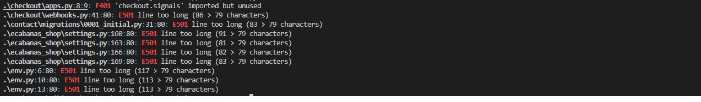

I minimized the number of errors by removing the unused imports and variables. The remaining errors are related to the length of the lines and the number of characters in the lines. I decided to leave them as they are as they do not affect the functionality of the website.

### LightHouse

The website was tested using the [LightHouse](https://developers.google.com/web/tools/lighthouse) tool. The following results were obtained:

| Page | Result |
| --- | --- |
| Home page | 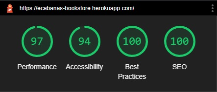 |
| Book list page | 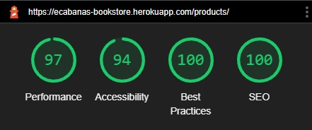 |
| Book detail page | 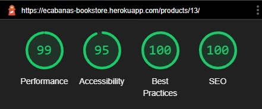 |
| Book form page | 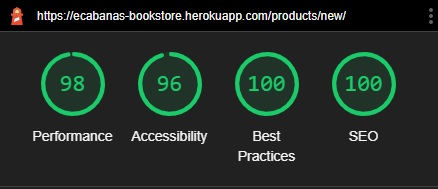 |
| Book confirm delete page | 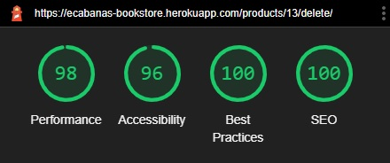 |
| About page | 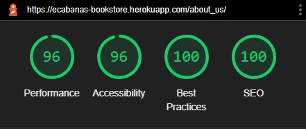 |
| FAQ page | 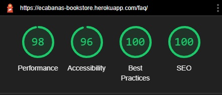 |
| Contact page | 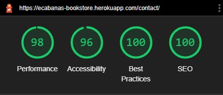 |
| Cart page | 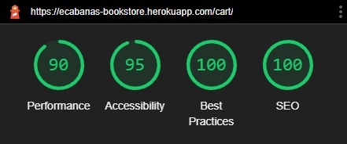 |
| Checkout page | 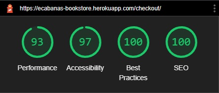 |
| Checkout success page | 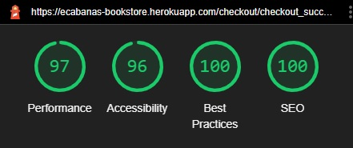 |
| Profile page | 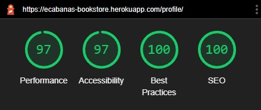 |
| Favourites page | 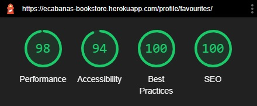 |

## Devices compatibility testing

The results of the testing on the different devices are shown in the following table:

| Device | Outcome | Result |
| --- | --- | --- |
| iPhone 5/SE | No issues found | Pass |
| iPhone 6/7/8 | No issues found | Pass |
| iPhone 6/7/8 Plus | No issues found | Pass |
| iPad | No issues found | Pass |
| Samsung Galaxy S5 | No issues found | Pass |
| Dell XPS 13 | No issues found | Pass |

## Browsers compatibility testing

The results of the testing on the different browsers are shown in the following table:

| Browser | Outcome | Result |
| --- | --- | --- |
| Chrome | No issues found | Pass |
| Firefox | No issues found | Pass |
| Safari | No issues found | Pass |
| Edge | No issues found | Pass |

## Manual testing

### Site navigation

| Action | Expected result | Actual result | Pass/Fail |
| --- | --- | --- | --- |
| Click on the logo in the navbar | The user is redirected to the home page | The user is redirected to the home page | Pass |
| Click on the search icon in the navbar | The user is redirected to the book list page | The user is redirected to the book list page | Pass |
| Type a search term in the search bar and click on the search icon | The user is redirected to the book list page with the search results | The user is redirected to the book list page with the search results | Pass |
| Click on the user icon in the navbar | The user is redirected to the login page | The user is redirected to the login page | Pass |
| If not logged in, click on the user icon in the navbar | Shows the login and register links | Shows the login and register links | Pass |
| If logged in, click on the user icon in the navbar | Shows the My Account, favourites, logout links | Shows the my account, favourites, logout links | Pass |
| If logged in, click on the user icon in the navbar | The user is redirected to the profile page | The user is redirected to the profile page | Pass |
| Click on the cart icon in the navbar | The user is redirected to the cart page | The user is redirected to the cart page | Pass |
| Click on the amount of items in the cart in the navbar | The user is redirected to the cart page | The user is redirected to the cart page | Pass |
| Click on the "Books" link in the navbar | The user is redirected to the book list page | The user is redirected to the book list page | Pass |
| Click on the "Books" category (All/Fiction/Non-Fiction) menu item | The user is redirected to the book list page | The user is redirected to the book list page | Pass |
| Click on the "About" link in the navbar | The user is redirected to the about page | The user is redirected to the about page | Pass |
| Click on the "FAQ" link in the navbar | The user is redirected to the FAQ page | The user is redirected to the FAQ page | Pass |
| Click on the "Contact" link in the navbar | The user is redirected to the contact page | The user is redirected to the contact page | Pass |
| Click on the footer links | The user is redirected to the corresponding page | The user is redirected to the corresponding page | Pass |
| When user fill email in newsletter form and click on the "Subscribe" button | The user is registered to the newsletter | The user is registered to the newsletter | Pass |
| When user click on the facebook icon in the footer | The user is redirected to the facebook page | The user is redirected to the facebook page | Pass |

### Home

| Action | Expected result | Actual result | Pass/Fail |
| --- | --- | --- | --- |
| Click on the "Start browsing here" button | The user is redirected to the book list page | The user is redirected to the book list page | Pass |

### Books list

| Action | Expected result | Actual result | Pass/Fail |
| --- | --- | --- | --- |
| Click on the "Info" button | The user is redirected to the book detail page | The user is redirected to the book detail page | Pass |
| Click on the "Add to favourites" button | The book is added to the user's favourites list | The book is added to the user's favourites list | Pass |
| Click on the "Add to cart" button | The book is added to the user's cart | The book is added to the user's cart | Pass |
| If the user is not logged in, click on the "Add to favourites" button | The user is redirected to the login page | The user is redirected to the login page | Pass |
| If the user is logged in, click on the "Add to favourites" button | The book is added to the user's favourites list | The book is added to the user's favourites list | Pass |
| If the user is logged in, and the book is already in the user's favourites list, click on the "Add to favourites" button | The book is removed from the user's favourites list | The book is removed from the user's favourites list | Pass |
| If user is admin, click on the "Edit" button | The user is redirected to the book edit page | The user is redirected to the book edit page | Pass |
| If user is admin, click on the "Delete" button | The user is redirected to the book delete confirmation page | The user is redirected to the book delete confirmation page | Pass |
| If user click on the subcategory menu item | The user is redirected to the book list page with the filtered results | The user is redirected to the book list page with the filtered results | Pass |
| if user click on the "Sort by" menu item | The user is redirected to the book list page with the sorted results (title, price and raring) desc/asc | The user is redirected to the book list page with the sorted results | Pass |
| If user click on pagination links | The user is redirected to the book list page with the selected page | The user is redirected to the book list page with the selected page | Pass |
| If book is out of stock, the "Add to cart" button is disabled | The user cannot add the book to the cart | The user cannot add the book to the cart | Pass |
| If query is not found, the "No results found" message is displayed | The user is informed that no results were found | The user is informed that no results were found | Pass |
| If query total result is less than 6, the pagination is not displayed | The pagination is not displayed | The pagination is not displayed | Pass |
| If query total result is one the sort by menu is not displayed | The sort by menu is not displayed | The sort by menu is not displayed | Pass |

### Book details

| Action | Expected result | Actual result | Pass/Fail |
| --- | --- | --- | --- |
| If logged in, click on the "Add to favourites" button | The book is added to the user's favourites list | The book is added to the user's favourites list | Pass |
| If logged in, and the book is already in the user's favourites list, click on the "Add to favourites" button | The book is removed from the user's favourites list | The book is removed from the user's favourites list | Pass |
| If user is admin, click on the "Edit" button | The user is redirected to the book edit page | The user is redirected to the book edit page | Pass |
| If user is admin, click on the "Delete" button | The user is redirected to the book delete confirmation page | The user is redirected to the book delete confirmation page | Pass |
| If user try to add more items than the stock, the quantity is set to the stock | The user cannot add more items than the stock | The user cannot add more items than the stock | Pass |
| if stock is 0, the "Add to cart" button is disabled | The user cannot add the book to the cart | The user cannot add the book to the cart | Pass |

### Cart

| Action | Expected result | Actual result | Pass/Fail |
| --- | --- | --- | --- |
| Click on the "Remove" button | The book is removed from the cart | The book is removed from the cart | Pass |
| Click on the "Update" button | The cart is updated with the new quantity | The cart is updated with the new quantity | Pass |
| Click on the "Checkout" button | The user is redirected to the checkout page | The user is redirected to the checkout page | Pass |
| If user tries to add more items than the stock, the quantity is set to the stock | The user cannot add more items than the stock | The user cannot add more items than the stock | Pass |
| If user types non-numeric characters in the quantity field, the input doesnt change | The user cannot add non-numeric characters in the quantity field | The user cannot add non-numeric characters in the quantity field | Pass |
| If user types 0 or left the field empty and update the cart, the book is removed from the cart | The user cannot add 0 or empty quantity in the quantity field | The user cannot add 0 or empty quantity in the quantity field | Pass |
| Button minus is disabled if the quantity is 1 | The user cannot add less than 1 item in the quantity field | The user cannot add less than 1 item in the quantity field | Pass |
| If user click on book cover image, the user is redirected to the book detail page | The user is redirected to the book detail page | The user is redirected to the book detail page | Pass |
| If user click on keep shopping button, the user is redirected to the book list page | The user is redirected to the book list page | The user is redirected to the book list page | Pass |

### Checkout

| Action | Expected result | Actual result | Pass/Fail |
| --- | --- | --- | --- |
| Click on the "Complete Order" button | The user is redirected to the checkout success page | The user is redirected to the checkout success page | Pass |
| Click on the "Adjust Cart" button | The user is redirected to the cart page | The user is redirected to the cart page | Pass |
| If user doesn't fill the form, the error message is displayed | The user is informed that the form is not valid | The user is informed that the form is not valid | Pass |
| If user click on the book cover image, the user is redirected to the book detail page | The user is redirected to the book detail page | The user is redirected to the book detail page | Pass |
| If info is not valid, the error message is displayed | The user is informed that the form is not valid | The user is informed that the form is not valid | Pass |
| If info is correct, the order is completed | The user is redirected to the checkout success page | The user is redirected to the checkout success page | Pass |

### My Account

| Action | Expected result | Actual result | Pass/Fail |
| --- | --- | --- | --- |
| Click on the "Update information" button, account info is updated | The user is redirected to the account info page | The user is redirected to the account info page | Pass |
| Click on the order number, the user is redirected to the order detail page | The user is redirected to the order detail page | The user is redirected to the order detail page | Pass |

### Contact

| Action | Expected result | Actual result | Pass/Fail |
| --- | --- | --- | --- |
| Click on the "Send" button, the message is sent | The user is redirected to the contact page | The user is redirected to the contact page | Pass |
| If user doesn't fill the form, the error message is displayed | The user is informed that the form is not valid | The user is informed that the form is not valid | Pass |
| If message is sent, the success message is displayed | The user is informed that the message is sent | The user is informed that the message is sent | Pass |

## Fixed Bugs

| Bug | Description | Fixed |
| --- | --- | --- |
| Duplicate remove ID in cart trash button causes html error | The remove button in the cart page has duplicate ID | Fixed modifying the JS code by removing class instead of ID |
| Toast success shows list of books doesn't matter the success action | All the success toast reference to the same function | Fixed by adding a new extra tag for each success toast |
| When stock is 0, cart button is still enabled | The cart button is still enabled when stock is 0 | Fixed by adding a new condition on template code |
| When type non-numeric characters in the quantity field, causes html error | The quantity field accepts non-numeric characters | Fixed by adding a new condition on the quantity js code and added to book details and cart templates |
| Ajax results list is not limited and display full list of books | The ajax results list is not limited and display full list of books | Fixed by adding a new condition on the ajax js code, limiting by 5 results and show "Show more" link |
| Regex for book title and description wasn't working as expected | The regex for book title and description wasn't working as expected | Fixed by removing the regex and adding a new condition on the form validation code | (need more learning on this topic ^^)

